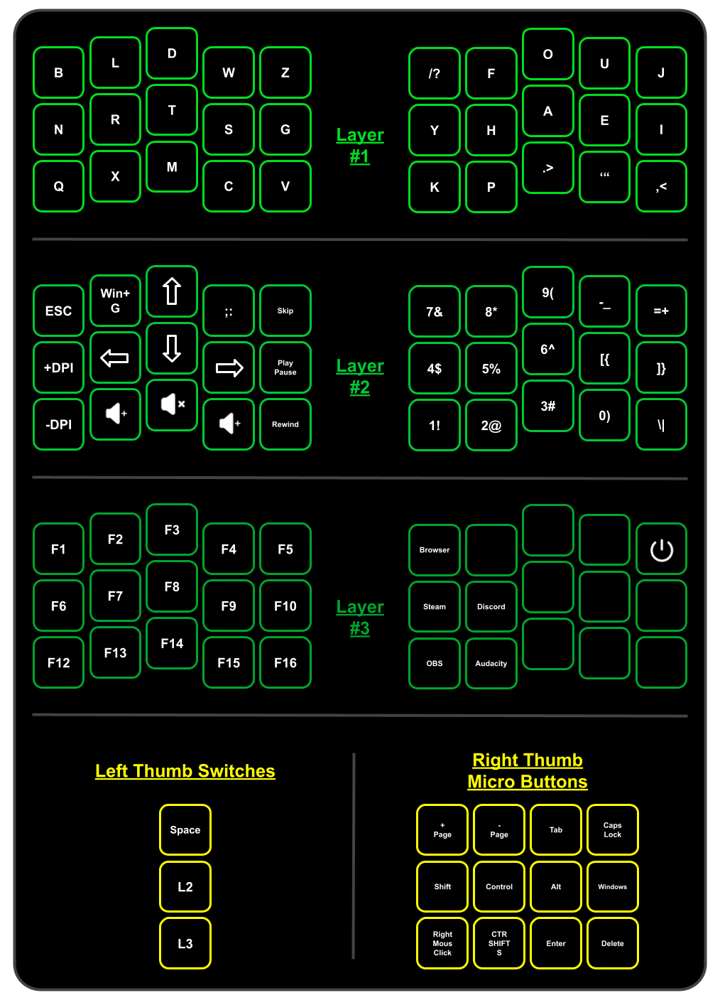

> Here I will be keeping track and updates of the custom keyboard I am trying to create.

## **Description:**
> The keyboard I am going for is a Columnar Staggered Layout with 30 main switches, and 3 thumb switches, for a total of 33 switches. the 3 extra thumb switches will be placed on the left side, while the right side will have a trackball (Sitting under the right hand's pointer nuckle, making is tucked away and easy for the thumb to use) along with a 12 micro button layout, similar to that of the [Razer Naga Trinity](https://cdn.discordapp.com/attachments/885915655042396221/1192754469453176833/iu.png?ex=65aa3a29&is=6597c529&hm=ea07b05ef3efae25280f13c2afefbb8f0308de548e90e4408bebcbec61f55034&) 12 button pannel. the main switches are going to be inside of a very very curved well being, pushing toward you for the bottom row, pushing down for the middle row, and pushing slightly away from you for the top row. The scroll wheel (Which I have not seen on a trackball keyboard yet) will be placed on the right board, between the space switch, and the starting of the layer switches. There will be an extra micro button near the trackball's sensor, as the left click, so puching the ball into the socket will be my main mouse click. I am hoping to have all of this blutooth, maybe if I can, adding a pairing mode, and a dongle, that way I can connect without a dongle if need for a lack of USB space, or for something like connecting to a phone. I am planning on using 12,000 mAh batteries as I am not worries about the weight of the keyboard, but I do still want it to be reasonably small. I would like for it to last a long time on one charge, and since I am adding so many features to this board, I feel like a bigger battery is needed. The general feel of the keyboard I am going for is something like holding a water bottle, so your main 4 fingers are on one side, while your thumb is on the opposite side, creating what I beilive to be an even more natural feel. This keyboard will have pegs for adjustable tenting if need be. For more information on the layout of the keyboard, take a look at the "Picture" diagram I made. I may look into adding some nobs for like volume controll, and some pole swithes for maybe turn my PC on and off, or swicthing on differnt profiles, so like a gaming profile that swithed my layout to QWERTY, and allows me to set custom layers within that profile too? or an LED off on switch too? I don't know, and cool stuff anyone suggests, and please DM me @jaycallahack on Discord, I am open to any suggestions and feedback, more so, I need it heh.

## **Major Help Needed**
> I am a "Broke Boy" (Pokimane*) and it takes me a long time to save up for anything, since I run my own business and currently do not have steady income (Hopefully I can get a part time job soon, but my health issues don't help) I do not have much income. If I could just pay some people to do certain things for my, while teaching me a bit about what it is that they are doing, then I would love to do that, as to not create so much stress of having to learn how to do everything myself (Grantet the community is a life saver on giving help, and Github is a greate place to look, but it does not solve all my problems sadly), I say all that cause I need some MAJOR help. Mainly for now I am looking for some help on the physical parts I am going to need to make this, stuff for soldering, switches, lubes, PCB stuff, compenents, and anything else I may be missing from my current [Parts List](). After that, I am going to need some major help on software side of things, and how to set it up. if there is alredy something on github that we can use, great, if not, crap. If we could make our own softwear to accomedate all the stuff in this keyboard, and put it here on github, that would be epic, but even if we just need to make something specific to this, thats fine too, I want to be able to have all this open source, just like many other custom keyboard. links to everything, and step by step guides on how to. SUre this may be ambituos, but I think if the right people see this, and it may be you, then this could totally be possible. 

## **Parts List:**

| [MBK Legend Keycaps](https://clicketysplit.ca/products/mbk-legend-40s?variant=42100195983539)                                                                                                                                                                               | $78 |                                                     |
|-----------------------------------------------------------------------------------------------------------------------------------------------------------------------------------------------------------------------------------------------------------------------------|-----|-----------------------------------------------------|
| [Single Switch PCB Boards](https://www.etsy.com/ca/listing/1505060775/amoeba-king-single-switch-pcb-single-key?ga_order=most_relevant&ga_search_type=all&ga_view_type=gallery&ga_search_query=Amoeba&ref=sr_gallery-1-7&sts=1&organic_search_click=1&variation0=3599894975) | $35 | (30 Per Order)                                      |
| [Micro Switches](https://www.etsy.com/ca/listing/896799047/brass-stem-micro-tactile-switches?ref=cart)                                                                                                                                                                      | $16 | (1 Per Order)                                       |
| [Durock Switches](https://divinikey.com/products/durock-t1-tactile-switch)                                                                                                                                                                                                  | $28 | (18 per pack) Most Likely to go with these switches |
| [Bsun Raw Switches](https://divinikey.com/products/bsun-raw-switches?variant=40431903014977)                                                                                                                                                                                | $24 | (18 per pack) Get For testing (Sound And Feel)      |
| [205 Grade 0 Switch Lube](https://divinikey.com/products/205-grade-0-switch-lubricant)                                                                                                                                                                                      | $11 | (For 3mL)                                           |
| [GPL 105 Oil Switch Lubricant](https://divinikey.com/products/gpl-105-oil-lubricant)                                                                                                                                                                                        | $13 | (For 5mL)                                           |
| [High Density Foam](https://www.amazon.ca/Cosplay-Premium-Density-Projects-MEARCOOH/dp/B0BFWLN5KW/ref=sr_1_1?crid=2EGZ98N1CQ4IP&keywords=high%2Bdensity%2Bfoam%2Bpanels%2B5mm&qid=1703987411&sprefix=high%2Bdensity%2Bfoam%2Bpannals%2B5mm%2Caps%2C115&sr=8-1&th=1)         | $20 | (35 x 10.5 x 5mm)                                   |
| [Hot swap sockets](https://divinikey.com/products/kailh-hot-swap-sockets)                                                                                                                                                                                                   | $14 | (100 per pack)                                      |
| [Track Ball Sensor](https://www.epsglobal.com/products/semiconductors/sensing-and-haptics/optical-navigation/low-power-laser-mouse-sensor?utm_source=octopart&utm_medium=ppc)                                                                                               | ??? |                                                     |

** ** 

## **Key Layout**

## **GitHub Links** *(Software Side)*:
1. [Trackball Sensor](https://github.com/ufan/pmw3610_breakout)
2. [The Dactyl-ManuForm Keyboard](https://github.com/abstracthat/dactyl-manuform)
3. [Charybdis](https://github.com/Bastardkb/Charybdis)
